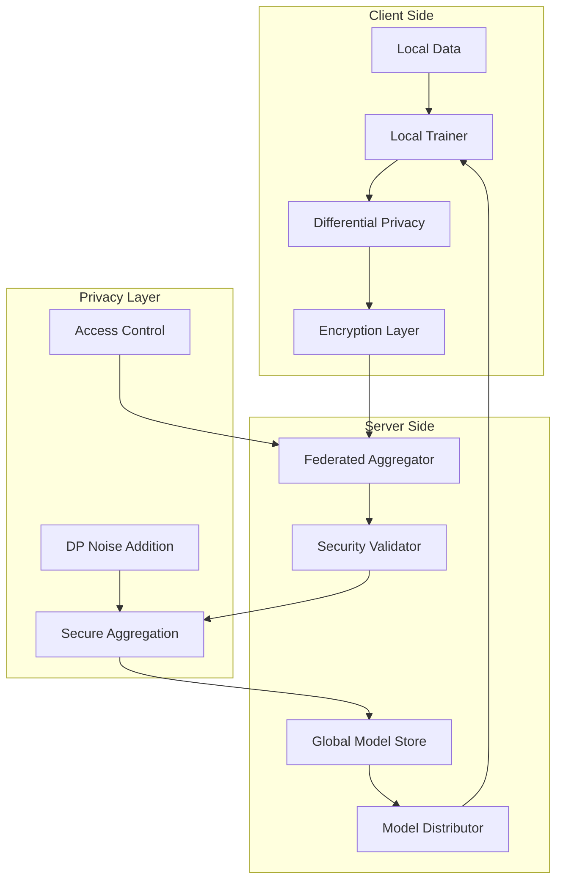

# Federated Learning Technical Documentation

## Overview

The AI Assistant implements a privacy-preserving federated learning system that enables personalized AI models while keeping user data on their devices. This document provides technical details about the implementation, privacy guarantees, and operational procedures.

## Architecture

### System Components



### Core Algorithms

#### 1. Federated Averaging (FedAvg)

The system uses the FedAvg algorithm for model aggregation:

```python
def federated_averaging(client_updates, client_weights):
    """
    Aggregate client model updates using weighted averaging.
    
    Args:
        client_updates: List of model parameter updates from clients
        client_weights: List of weights (typically based on local data size)
    
    Returns:
        Aggregated global model parameters
    """
    total_weight = sum(client_weights)
    
    # Initialize aggregated parameters
    aggregated_params = {}
    
    for param_name in client_updates[0].keys():
        weighted_sum = sum(
            weight * update[param_name] 
            for update, weight in zip(client_updates, client_weights)
        )
        aggregated_params[param_name] = weighted_sum / total_weight
    
    return aggregated_params
```

#### 2. Differential Privacy

Local differential privacy is applied to model updates:

```python
class DifferentialPrivacyManager:
    def __init__(self, epsilon=1.0, delta=1e-5):
        self.epsilon = epsilon  # Privacy budget
        self.delta = delta      # Failure probability
        
    def add_noise(self, model_update, sensitivity=1.0):
        """
        Add Gaussian noise to model parameters for differential privacy.
        
        Args:
            model_update: Model parameter updates
            sensitivity: L2 sensitivity of the update
            
        Returns:
            Noisy model update
        """
        sigma = self.calculate_noise_scale(sensitivity)
        
        noisy_update = {}
        for param_name, param_value in model_update.items():
            noise = np.random.normal(0, sigma, param_value.shape)
            noisy_update[param_name] = param_value + noise
            
        return noisy_update
    
    def calculate_noise_scale(self, sensitivity):
        """Calculate noise scale for Gaussian mechanism."""
        return sensitivity * np.sqrt(2 * np.log(1.25 / self.delta)) / self.epsilon
```

## Privacy Guarantees

### Differential Privacy Parameters

- **Epsilon (ε)**: 1.0 (privacy budget per user per round)
- **Delta (δ)**: 1e-5 (failure probability)
- **Mechanism**: Gaussian noise addition
- **Composition**: Advanced composition for multiple rounds

### Privacy Budget Management

```python
class PrivacyBudgetTracker:
    def __init__(self, total_budget=10.0):
        self.total_budget = total_budget
        self.user_budgets = {}
        
    def allocate_budget(self, user_id, requested_budget):
        """
        Allocate privacy budget for a user's participation.
        
        Args:
            user_id: User identifier
            requested_budget: Amount of budget requested
            
        Returns:
            Boolean indicating if allocation is successful
        """
        current_usage = self.user_budgets.get(user_id, 0.0)
        
        if current_usage + requested_budget <= self.total_budget:
            self.user_budgets[user_id] = current_usage + requested_budget
            return True
        return False
    
    def get_remaining_budget(self, user_id):
        """Get remaining privacy budget for a user."""
        used_budget = self.user_budgets.get(user_id, 0.0)
        return max(0.0, self.total_budget - used_budget)
```

### Security Measures

#### 1. Secure Aggregation

Prevents the server from seeing individual model updates:

```python
class SecureAggregationProtocol:
    def __init__(self, threshold=5):
        self.threshold = threshold  # Minimum participants for aggregation
        
    def aggregate_securely(self, encrypted_updates):
        """
        Perform secure aggregation of encrypted model updates.
        
        Args:
            encrypted_updates: List of encrypted model updates
            
        Returns:
            Aggregated model without revealing individual updates
        """
        if len(encrypted_updates) < self.threshold:
            raise ValueError("Insufficient participants for secure aggregation")
        
        # Homomorphic aggregation (simplified)
        aggregated_encrypted = self.homomorphic_sum(encrypted_updates)
        
        # Decrypt only the aggregated result
        return self.decrypt_aggregate(aggregated_encrypted)
```

#### 2. Model Update Validation

```python
class ModelUpdateValidator:
    def __init__(self, max_norm=10.0, min_participants=3):
        self.max_norm = max_norm
        self.min_participants = min_participants
        
    def validate_update(self, model_update, user_id):
        """
        Validate a model update for security and correctness.
        
        Args:
            model_update: Encrypted model update
            user_id: User identifier
            
        Returns:
            Validation result with details
        """
        validation_result = {
            "valid": True,
            "errors": [],
            "warnings": []
        }
        
        # Check update norm
        if self.calculate_update_norm(model_update) > self.max_norm:
            validation_result["valid"] = False
            validation_result["errors"].append("Update norm exceeds maximum")
        
        # Check for malicious patterns
        if self.detect_malicious_patterns(model_update):
            validation_result["valid"] = False
            validation_result["errors"].append("Malicious pattern detected")
        
        return validation_result
```

## Implementation Details

### Local Training Process

#### 1. Data Preparation

```python
class LocalDataProcessor:
    def __init__(self, user_id):
        self.user_id = user_id
        
    def prepare_training_data(self, raw_interactions):
        """
        Prepare user interaction data for local training.
        
        Args:
            raw_interactions: Raw user interaction logs
            
        Returns:
            Processed training dataset
        """
        # Extract features from interactions
        features = self.extract_features(raw_interactions)
        
        # Create training examples
        training_data = self.create_training_examples(features)
        
        # Apply privacy-preserving transformations
        private_data = self.apply_privacy_transforms(training_data)
        
        return private_data
    
    def extract_features(self, interactions):
        """Extract relevant features from user interactions."""
        features = []
        
        for interaction in interactions:
            feature_vector = {
                'time_of_day': interaction.timestamp.hour,
                'day_of_week': interaction.timestamp.weekday(),
                'interaction_type': interaction.type,
                'duration': interaction.duration,
                'context': self.encode_context(interaction.context)
            }
            features.append(feature_vector)
            
        return features
```

#### 2. Model Training

```python
class LocalModelTrainer:
    def __init__(self, model_config):
        self.model = self.initialize_model(model_config)
        self.optimizer = torch.optim.Adam(self.model.parameters())
        
    def train_local_model(self, training_data, global_model_params):
        """
        Train local model on user data.
        
        Args:
            training_data: Local training dataset
            global_model_params: Current global model parameters
            
        Returns:
            Model parameter updates
        """
        # Load global model parameters
        self.model.load_state_dict(global_model_params)
        
        # Store initial parameters
        initial_params = copy.deepcopy(self.model.state_dict())
        
        # Local training loop
        for epoch in range(self.local_epochs):
            for batch in self.create_batches(training_data):
                self.optimizer.zero_grad()
                
                # Forward pass
                outputs = self.model(batch['features'])
                loss = self.compute_loss(outputs, batch['labels'])
                
                # Backward pass
                loss.backward()
                self.optimizer.step()
        
        # Compute parameter updates
        final_params = self.model.state_dict()
        updates = {}
        
        for param_name in initial_params:
            updates[param_name] = (
                final_params[param_name] - initial_params[param_name]
            )
        
        return updates
```

### Server-Side Aggregation

#### 1. Round Management

```python
class FederatedRoundManager:
    def __init__(self, min_participants=5, max_wait_time=3600):
        self.min_participants = min_participants
        self.max_wait_time = max_wait_time
        self.current_round = None
        
    async def start_new_round(self):
        """Start a new federated learning round."""
        self.current_round = FederatedRound(
            round_number=self.get_next_round_number(),
            model_version=self.get_current_model_version(),
            started_at=datetime.utcnow(),
            aggregation_status="in_progress"
        )
        
        # Set round timeout
        asyncio.create_task(self.handle_round_timeout())
        
        return self.current_round
    
    async def handle_round_timeout(self):
        """Handle round timeout and trigger aggregation."""
        await asyncio.sleep(self.max_wait_time)
        
        if (self.current_round and 
            self.current_round.aggregation_status == "in_progress"):
            
            participant_count = self.get_participant_count()
            
            if participant_count >= self.min_participants:
                await self.trigger_aggregation()
            else:
                await self.extend_round()
```

#### 2. Model Aggregation

```python
class FederatedAggregator:
    def __init__(self, privacy_manager, validator):
        self.privacy_manager = privacy_manager
        self.validator = validator
        
    async def aggregate_round(self, round_id):
        """
        Aggregate model updates for a federated round.
        
        Args:
            round_id: Federated round identifier
            
        Returns:
            Aggregated global model
        """
        # Get all client updates for the round
        client_updates = await self.get_client_updates(round_id)
        
        # Validate updates
        valid_updates = []
        for update in client_updates:
            if self.validator.validate_update(update):
                valid_updates.append(update)
        
        if len(valid_updates) < self.min_participants:
            raise ValueError("Insufficient valid updates for aggregation")
        
        # Decrypt updates (if using secure aggregation)
        decrypted_updates = [
            self.decrypt_update(update) for update in valid_updates
        ]
        
        # Calculate client weights (based on local data size)
        weights = [update.sample_count for update in decrypted_updates]
        
        # Perform federated averaging
        aggregated_model = self.federated_averaging(
            decrypted_updates, weights
        )
        
        # Apply server-side differential privacy (optional)
        if self.privacy_manager.server_side_dp_enabled:
            aggregated_model = self.privacy_manager.add_server_noise(
                aggregated_model
            )
        
        return aggregated_model
```

## API Integration

### Client-Side Integration

#### 1. Training Initiation

```python
# Start local training
training_request = {
    "user_id": user_id,
    "training_data": {
        "interactions": user_interactions,
        "preferences": user_preferences
    },
    "model_config": {
        "architecture": "transformer",
        "hidden_size": 256,
        "num_layers": 4
    }
}

response = await client.post("/fedl/train", json=training_request)
task_id = response.json()["task_id"]
```

#### 2. Model Update Upload

```python
# Upload trained model update
update_request = {
    "user_id": user_id,
    "model_delta_encrypted": base64.b64encode(encrypted_update).decode(),
    "privacy_budget_used": 0.1,
    "training_metrics": {
        "loss": 0.23,
        "accuracy": 0.87,
        "samples_count": 1000
    }
}

response = await client.post("/fedl/round/upload", json=update_request)
```

### Server-Side Processing

#### 1. Round Status Monitoring

```python
# Check aggregation status
response = await client.get(f"/fedl/round/{round_id}/status")
status = response.json()

if status["status"] == "completed":
    # Download new global model
    model_response = await client.get("/fedl/model/current")
    global_model = model_response.json()
```

## Performance Optimization

### 1. Model Compression

```python
class ModelCompressor:
    def __init__(self, compression_ratio=0.1):
        self.compression_ratio = compression_ratio
        
    def compress_update(self, model_update):
        """
        Compress model update to reduce communication overhead.
        
        Args:
            model_update: Model parameter updates
            
        Returns:
            Compressed model update
        """
        compressed_update = {}
        
        for param_name, param_tensor in model_update.items():
            # Apply top-k sparsification
            compressed_update[param_name] = self.top_k_sparsify(
                param_tensor, self.compression_ratio
            )
        
        return compressed_update
    
    def top_k_sparsify(self, tensor, ratio):
        """Keep only top-k elements by magnitude."""
        flat_tensor = tensor.flatten()
        k = int(len(flat_tensor) * ratio)
        
        # Get top-k indices
        _, top_k_indices = torch.topk(torch.abs(flat_tensor), k)
        
        # Create sparse tensor
        sparse_tensor = torch.zeros_like(flat_tensor)
        sparse_tensor[top_k_indices] = flat_tensor[top_k_indices]
        
        return sparse_tensor.reshape(tensor.shape)
```

### 2. Adaptive Aggregation

```python
class AdaptiveAggregator:
    def __init__(self):
        self.convergence_threshold = 0.01
        self.staleness_threshold = 5
        
    def should_aggregate(self, round_info):
        """
        Determine if aggregation should be triggered.
        
        Args:
            round_info: Current round information
            
        Returns:
            Boolean indicating if aggregation should start
        """
        # Check minimum participants
        if round_info.participant_count < self.min_participants:
            return False
        
        # Check convergence
        if self.check_convergence(round_info):
            return True
        
        # Check staleness
        if self.check_staleness(round_info):
            return True
        
        return False
```

## Monitoring and Metrics

### 1. Privacy Metrics

```python
class PrivacyMetricsCollector:
    def __init__(self):
        self.metrics = {}
        
    def track_privacy_budget_usage(self, user_id, budget_used):
        """Track privacy budget consumption."""
        if user_id not in self.metrics:
            self.metrics[user_id] = {
                "total_budget_used": 0.0,
                "rounds_participated": 0,
                "last_participation": None
            }
        
        self.metrics[user_id]["total_budget_used"] += budget_used
        self.metrics[user_id]["rounds_participated"] += 1
        self.metrics[user_id]["last_participation"] = datetime.utcnow()
    
    def get_system_privacy_level(self):
        """Calculate overall system privacy level."""
        if not self.metrics:
            return "High"
        
        avg_budget_used = np.mean([
            m["total_budget_used"] for m in self.metrics.values()
        ])
        
        if avg_budget_used < 2.0:
            return "High"
        elif avg_budget_used < 5.0:
            return "Medium"
        else:
            return "Low"
```

### 2. Model Quality Metrics

```python
class ModelQualityTracker:
    def __init__(self):
        self.round_metrics = []
        
    def track_round_quality(self, round_id, metrics):
        """Track model quality for a federated round."""
        quality_metrics = {
            "round_id": round_id,
            "timestamp": datetime.utcnow(),
            "global_loss": metrics.get("loss", 0.0),
            "global_accuracy": metrics.get("accuracy", 0.0),
            "convergence_rate": self.calculate_convergence_rate(metrics),
            "participant_count": metrics.get("participants", 0)
        }
        
        self.round_metrics.append(quality_metrics)
    
    def calculate_convergence_rate(self, metrics):
        """Calculate model convergence rate."""
        if len(self.round_metrics) < 2:
            return 0.0
        
        current_loss = metrics.get("loss", 0.0)
        previous_loss = self.round_metrics[-1]["global_loss"]
        
        return abs(previous_loss - current_loss) / previous_loss
```

## Security Considerations

### 1. Attack Mitigation

```python
class SecurityMonitor:
    def __init__(self):
        self.anomaly_detector = AnomalyDetector()
        
    def detect_byzantine_attacks(self, client_updates):
        """
        Detect Byzantine attacks in client updates.
        
        Args:
            client_updates: List of client model updates
            
        Returns:
            List of potentially malicious update indices
        """
        suspicious_updates = []
        
        for i, update in enumerate(client_updates):
            # Check for abnormal update magnitude
            if self.check_abnormal_magnitude(update):
                suspicious_updates.append(i)
            
            # Check for gradient inversion attacks
            if self.detect_gradient_inversion(update):
                suspicious_updates.append(i)
        
        return suspicious_updates
    
    def robust_aggregation(self, client_updates, suspicious_indices):
        """
        Perform robust aggregation excluding suspicious updates.
        
        Args:
            client_updates: All client updates
            suspicious_indices: Indices of suspicious updates
            
        Returns:
            Robustly aggregated model
        """
        # Remove suspicious updates
        clean_updates = [
            update for i, update in enumerate(client_updates)
            if i not in suspicious_indices
        ]
        
        # Use robust aggregation method (e.g., Krum, trimmed mean)
        return self.krum_aggregation(clean_updates)
```

### 2. Audit and Compliance

```python
class FederatedLearningAuditor:
    def __init__(self):
        self.audit_log = []
        
    def log_round_completion(self, round_info, privacy_metrics):
        """Log federated round completion for audit."""
        audit_entry = {
            "timestamp": datetime.utcnow(),
            "round_id": round_info.round_id,
            "participants": round_info.participant_count,
            "privacy_budget_consumed": privacy_metrics.total_budget_used,
            "model_quality": round_info.final_metrics,
            "compliance_status": self.check_compliance(round_info)
        }
        
        self.audit_log.append(audit_entry)
    
    def generate_compliance_report(self, start_date, end_date):
        """Generate compliance report for a date range."""
        relevant_entries = [
            entry for entry in self.audit_log
            if start_date <= entry["timestamp"] <= end_date
        ]
        
        return {
            "total_rounds": len(relevant_entries),
            "total_participants": sum(e["participants"] for e in relevant_entries),
            "privacy_budget_usage": self.calculate_privacy_usage(relevant_entries),
            "compliance_violations": self.find_violations(relevant_entries)
        }
```

## Troubleshooting

### Common Issues

1. **Insufficient Participants**
   - Increase round timeout
   - Lower minimum participant threshold
   - Implement participant incentives

2. **Poor Model Convergence**
   - Adjust learning rates
   - Increase local training epochs
   - Check data quality and distribution

3. **Privacy Budget Exhaustion**
   - Implement budget recycling
   - Adjust epsilon values
   - Use more efficient DP mechanisms

4. **Communication Overhead**
   - Implement model compression
   - Use federated dropout
   - Optimize update frequency

### Debug Tools

```python
# Enable detailed logging
import logging
logging.getLogger("federated_learning").setLevel(logging.DEBUG)

# Monitor round progress
async def monitor_round_progress(round_id):
    while True:
        status = await get_round_status(round_id)
        print(f"Round {round_id}: {status['participant_count']} participants, "
              f"{status['progress_percentage']:.1f}% complete")
        
        if status["status"] == "completed":
            break
        
        await asyncio.sleep(30)
```

## References

- [Federated Learning: Collaborative Machine Learning without Centralized Training Data](https://ai.googleblog.com/2017/04/federated-learning-collaborative.html)
- [Communication-Efficient Learning of Deep Networks from Decentralized Data](https://arxiv.org/abs/1602.05629)
- [The Algorithmic Foundations of Differential Privacy](https://www.cis.upenn.edu/~aaroth/Papers/privacybook.pdf)
- [Practical Secure Aggregation for Privacy-Preserving Machine Learning](https://eprint.iacr.org/2017/281.pdf)